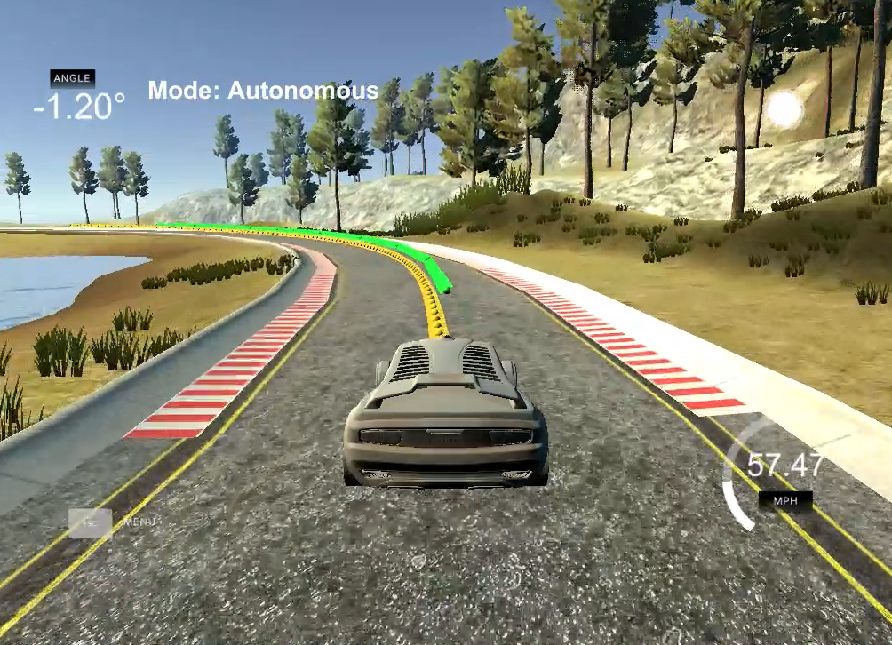
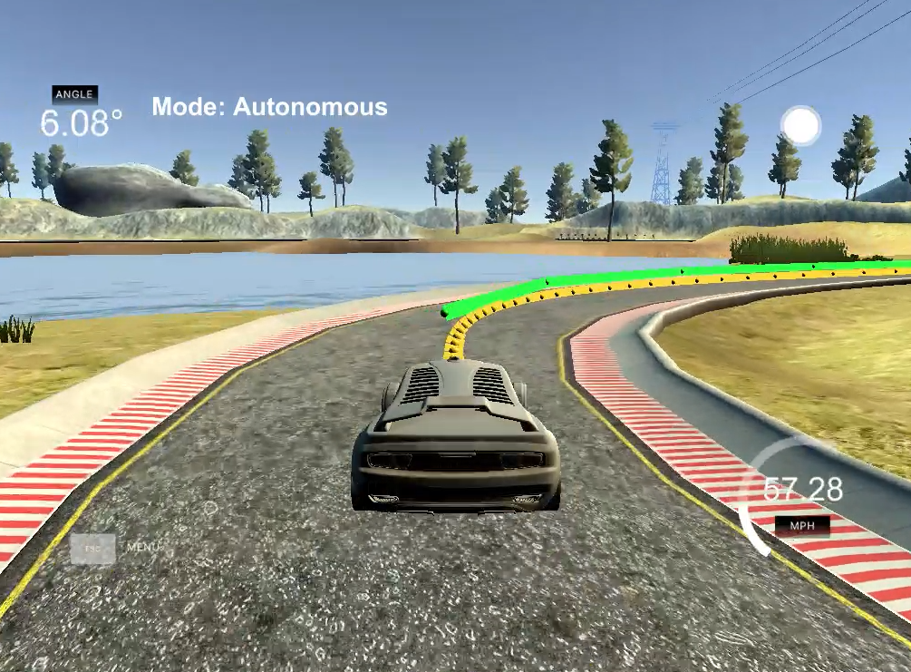

# Model Predictive Control(MPC)

A C++ implementation of Model Predictive Control(MPC)

[Demo video (YouTube)](https://www.youtube.com/watch?v=5syxpdcEfLA)

 

## Overview

Model Predictive Control is a feedback control method to get a appropriate control input by solving optimization problem.

For autonomous vehicle, control input means steering wheel and throttle(and break pedal). Assuming we know reference trajectory, we predicte next N steps' waypoints according to kinematic model(for simplicity) over some pattern, and calculate cost function for each to find most appropriate predicted trajectory. Then we use the first control input of the predicted trajectory and throw away the other trajectory. That's it. We only need to repeat this.

Implementation code is in `MPC.cpp` and `main.cpp`

## Kinematic model equations

Kinematic model handles several status: car's x, y position, orientation, velocity, cross track error(= cte: distance between reference trajectory and actual trajectory), orientation error(= epsi: difference between desired orientation and current orientation). And belows are equations to calculate those at next timestep.

